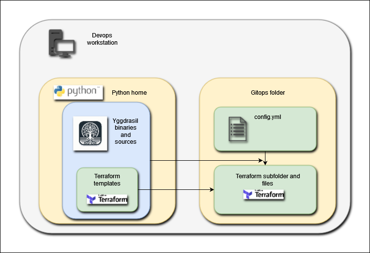

# Yggdrasil


- [Yggdrasil](#yggdrasil)
	- [Yggdrasil overview](#yggdrasil-overview)
		- [Input](#input)
		- [Creation of a Terraform folder](#creation-of-a-terraform-folder)
		- [Terraform Wrapper](#terraform-wrapper)
		- [Ansible Wrapper](#ansible-wrapper)
	- [Quickstart](#quickstart)
		- [Get Yggdrasil sources](#get-yggdrasil-sources)
		- [Running Yggdrasil through Docker](#running-yggdrasil-through-docker)
		- [Execution of basic Yggdrasil commands](#execution-of-basic-yggdrasil-commands)
	- [Installation](#installation)
	- [Project configuration](#project-configuration)
	- [Scope configuration](#scope-configuration)
	- [Yggdrasil commands](#yggdrasil-commands)
	- [Development](#development)
		- [Modules](#modules)
		- [CLI](#cli)
	- [Debug](#debug)
	- [Backlog](#backlog)

Yggdrasil is a CLI software, distributed as a python package, that allows to deploy virtual machines on many public and private cloud providers, and to configure them with custom softwares and microservices stack.

Yggdrasil leverages :

- Terraform for Infrastructure as Code
- Ansible for Configuration Management
- Helm for deployment of Kubernetes stacks

## Yggdrasil overview

Yggdrasil embeds scripts and wraps Terraform and Ansible commands to provide the mechanism illustrated below :

### Input

The main input of Yggdrasil is a YAML file called `config.yml` describing the infrastructure you want to create and the software you want to install on this infrastructure.

### Creation of a Terraform folder

First, Yggdrasil makes use of its internal Terraform templates to create a dedicated (and autonomous) Terraform folder with its .tf files, as illustrated below :



### Terraform Wrapper

Then, Yggdrasil 
- wraps the Terraform commands to call the infrastructure provider (public or private cloud provider) to instantiate the resources described in `config.yml`
- collect the obtained output (including IP addresses of created VMs), as illustrated below :

### Ansible Wrapper


Once the infrastructures are created, Yggdrasil wraps Ansible commands :

First, Yggdrasil
- parses the Terraform output to extract the IP addresses and generate the files needed by Ansible to operate (`envt.hosts`, `ssh.cfg`, `ansible.cfg`), as illustrated below
- creates a meta-Ansible playbook that will call all the playbooks and roles listed in `config.yml` on the VMs.


Then, Yggdrasil wraps the Ansible commands to execute the meta-Ansible playbook on the VMs, as illustrated below :


## Quickstart

In order to run a quickstart of Yggdrasil on a public cloud provider (AWS, Azure or GCP), you need :

- the technical prerequisites for the chosen cloud provider, instructions [here](doc/prerequisites_cloud_credentials.md)
- a Unix shell
- git and Docker installed on your workstation
- a work folder

### Get Yggdrasil sources

Go to your work folder, then run the following command to get Yggdrasil's sources :

```bash
cd <YOUR_CHOSEN_WORKING_DIRECTORY>
git clone https://github.com/LumaxTechnologies/yggdrasil
```

### Running Yggdrasil through Docker

Run the following command in the root folder of the Yggdrasil project :

```bash
cd Yggdrasil
docker build -t yggdrasil .
```

Once you have built and/or pulled the docker, move into a dedicated working directory where you will execute Yggdrasil (the tool will dump many dedicated files and folders). Warning : you need writing rights in this directory :

```bash
cd <YOUR_CHOSEN_WORKING_DIRECTORY>
docker run -it -e USER=$USER -v $(pwd):/workdir -v /$HOME/.ssh:/root/.ssh yggdrasil bash
```

The command above will prompt you a shell command inside the Yggdrasil Docker. You can then proceed with the next instructions :

For details :

- `-e USER=$USER` is necessary to ensure that the `USER` environment variable is set to the current user, in order to SSH inside the remote hosts using your current user login
- `-v $(pwd):/workdir` mount local `gitops` folder inside the container
- `-v /$HOME/.ssh:/root/.ssh` mount the access to your SSH keys inside the container

You will get a bash prompt directly inside the docker. You local directory is mapped as the directory `workdir` inside the docker.

### Execution of basic Yggdrasil commands

We are going to create a small environment in your public cloud account, and configure it with a few softwares.

First, let us create a SSH key pair for the demo with the follow command :

```bash
ssh-keygen -q -t rsa -f /workdir/id_rsa -N ''
```

Then, we will setup the Yggdrasil root project. Execute the following commands :

```bash
cd /workdir
yggdrasil gitops init folder
```

You have just created a `gitops` folder that you populated with all the folders and configuration files necessary to start a Yggdrasil project.

Now it is time to set your cloud provider credentials :

```bash
cd gitops
yggdrasil . init C ### after this command, you will be asked for several credentials information. If you are not sure, do not use a Terraform backend for the demo
```

The command will prompt you a series of question about your chosen cloud provider credentials, and create a `.env` file inside the `gitops` folder, as well as `secrets/<YOUR_PROVIDER>/.env` files containing secrets for managing access to your provider.

You can now proceed to the creation of the infrastructure :

```bash
yggdrasil config/<CHOSEN_CLOUD_PROVIDER>/demo init 0
yggdrasil config/<CHOSEN_CLOUD_PROVIDER>/demo init 1
yggdrasil config/<CHOSEN_CLOUD_PROVIDER>/demo init 2
yggdrasil config/<CHOSEN_CLOUD_PROVIDER>/demo tf init
```

The next command will need you to type 'yes', when asked to create cloud resources :

```bash
yggdrasil config/<CHOSEN_CLOUD_PROVIDER>/demo tf apply
```

You will start to see Terraform logs in your shell.
It will probably take up to 15 minutes for your cloud provider to create all the resources needed.

Once everything is created, Terraform and Yggdrasil will give you back the upper hand. You can then proceed with the following instructions :

```bash
yggdrasil config/<CHOSEN_CLOUD_PROVIDER>/demo ans P
yggdrasil config/<CHOSEN_CLOUD_PROVIDER>/demo ans D
yggdrasil config/<CHOSEN_CLOUD_PROVIDER>/demo ans 1 -d
yggdrasil config/<CHOSEN_CLOUD_PROVIDER>/demo ans 2 -d
yggdrasil config/<CHOSEN_CLOUD_PROVIDER>/demo ans H
yggdrasil config/<CHOSEN_CLOUD_PROVIDER>/demo ans 3 -d
```

If everything went smoothly, you now have a dedicated architecture on your chosen cloud provider, with a software stack configured on it !

If you want to delete everything (to avoid unnecessary cloud costs, for example), run this command :

```bash
yggdrasil config/<CHOSEN_CLOUD_PROVIDER>/demo tf destroy
```

Once you have finished, you can leave the Yggdrasil docker with this command :

```bash
exit
```

## Installation

To install Yggdrasil the way you want, follow the detailed instructions [here](doc/install.md)

## Project configuration

Once you have installed Yggdrasil, to create and configure a Yggdrasil project, follow the detailed instructions [here](doc/project_configuration.md)

## Scope configuration

Once you have set up your Yggdrasil project, prepare a "scope" inside it to start deploying and configuring infrastructures, by following the instructions [here](doc/scope_configuration.md)

## Yggdrasil commands

You can find a detailed description of Yggdrasil's commands and how to use them to configure infrastructures [here](./doc/commands.md)

## Development

### Modules

If you want to develop Terraform and Ansible modules for Yggdrasil, development guidelines are available :

- for [Terraform](./doc/iac_guidelines.md)
- for [Ansible](./doc/ansible_guidelines.md)
- for [Helm](./doc/helm_guidelines.md)

### CLI

If you want to develop the Yggdrasil python package itself, a description of the code's structure is available [here](./doc/code_architecture.md)

## Debug

Various tips for development and debugging can be found [here](./doc/debug.md)

## Backlog

Backlog for requested features [here](./doc/backlog.md)

edition security file in ssh.cfg
